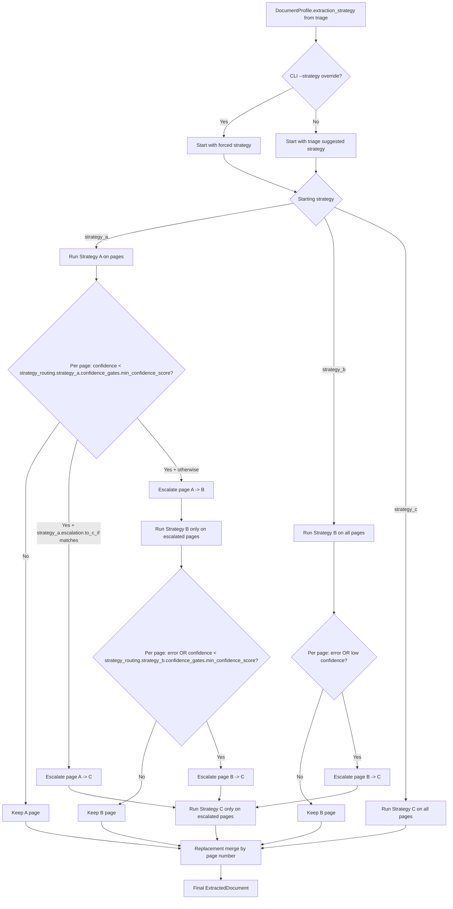

# Document Intelligence Refinery: Architecture Overview (Phase 2)

This document reflects the current Phase 2 implementation in `src/agents/extractor.py`, `src/strategies/strategy_a.py`, `src/strategies/strategy_b.py`, `src/strategies/strategy_c.py`, and `rubric/extraction_rules.yaml`.

## End-to-End Architecture (Phase 2)

```mermaid
flowchart TD
    RAW[Raw PDF Input] --> TRIAGE_IN

    subgraph S1[Stage 1: Triage]
        TRIAGE_IN[Triage Agent]\ntriage.scanned_detection\ntriage.mixed_gate\ntriage.layout_complexity --> PROFILE[DocumentProfile\norigin_type + layout_complexity + extraction_strategy]
        PROFILE --> START{Starting strategy\nDocumentProfile.extraction_strategy\nunless CLI --strategy override}
    end

    START -->|strategy_a| A_RUN
    START -->|strategy_b| B_RUN
    START -->|strategy_c| C_RUN

    subgraph S2[Stage 2: ExtractionRouter]
        direction TB
        ROUTER[ExtractionRouter\nrun starting strategy first] --> MERGE[Replacement merge\nreplace only escalated pages]
        MERGE --> OUT[ExtractedDocument\ninternal schema]
        OUT --> DOWN[Downstream (Phase 3/4 placeholder)]
    end

    subgraph STRAT[Strategy A/B/C]
        direction TB

        A_RUN[Strategy A (pdfplumber fast text)\nSignals: char_count, char_density, image_area_ratio, table_count\nConfidence: strategy_routing.strategy_a.confidence_gates]
        A_ESC{Page-level escalation from A\nif confidence < min_confidence_score\nstrategy_a.escalation.to_c_if ?}

        B_RUN[Strategy B (Docling layout extraction)\nPage-scoped execution on escalated subset\n(single-page temp PDFs)]
        B_ADAPT[DoclingDocumentAdapter\nnormalize to ExtractedDocument schema]
        B_ESC{Page-level escalation from B\nif error or confidence <\nstrategy_routing.strategy_b.confidence_gates.min_confidence_score}

        C_RUN[Strategy C (Vision)\nPage-scoped execution on escalated subset\n(single-page rendered images)]
        OCR[Primary OCR: strategy_routing.strategy_c.tools.primary_ocr]
        VLM[Fallback VLM: strategy_routing.strategy_c.tools.fallback_vlm\n(provider + model)]
        BUDGET[strategy_c.budget_guard\nmax_pages_per_document\nmax_vlm_pages_per_document\nmax_total_runtime_seconds\ntimeout_per_page_seconds]
    end

    A_RUN --> A_ESC
    A_ESC -->|default_target = strategy_b\n(page-level escalation)| B_RUN
    A_ESC -->|to_c_if image_area_ratio_gte +\nchar_density_lte + char_count_lte\n(page-level escalation)| C_RUN

    B_RUN --> B_ADAPT
    B_ADAPT --> B_ESC
    B_ESC -->|to strategy_c\n(page-level escalation)| C_RUN

    OCR -->|weak OCR or unavailable/failure policy| VLM
    C_RUN --> OCR
    C_RUN --> BUDGET

    START --> ROUTER
    A_RUN --> ROUTER
    B_ADAPT --> ROUTER
    C_RUN --> ROUTER

    subgraph ART[Artifacts (.refinery)]
        direction TB
        PROFILES[profiles/{doc_id}.json\nDocumentProfile snapshot]
        LEDGER[extraction_ledger/{doc_id}.jsonl\none row per executed page per strategy\nfields: strategy_used, confidence, signals,\ncost_estimate_usd, processing_time_sec, escalated_to\n(no duplicate doc_id+page_number+strategy_used)]
        EXTRACTED[extracted/{doc_id}.json\nExtractedDocument]
    end

    PROFILE --> PROFILES
    A_RUN --> LEDGER
    B_RUN --> LEDGER
    C_RUN --> LEDGER
    OUT --> EXTRACTED

    PROV[Provenance on emitted blocks\nrequired: page_number + bbox + content_hash\nbbox_precision tracked:\nblock_level (OCR/Docling) vs page_level (VLM fallback)] --> OUT

    subgraph LEGEND[Legend]
        L1[Green = Strategy A]
        L2[Yellow = Strategy B]
        L3[Red = Strategy C]
        L4[Blue/Purple = Router/Governance/Validation]
    end

    classDef stratA fill:#d9f7d9,stroke:#2e7d32,stroke-width:1px,color:#0b3d0b;
    classDef stratB fill:#fff4cc,stroke:#a67c00,stroke-width:1px,color:#4d3b00;
    classDef stratC fill:#ffd6d6,stroke:#b00020,stroke-width:1px,color:#5a0000;
    classDef gov fill:#e6edff,stroke:#3451b2,stroke-width:1px,color:#10245e;
    classDef val fill:#efe6ff,stroke:#6a3fb3,stroke-width:1px,color:#3e1f6b;

    class A_RUN,A_ESC stratA;
    class B_RUN,B_ADAPT,B_ESC stratB;
    class C_RUN,OCR,VLM stratC;
    class ROUTER,MERGE,OUT,PROFILES,LEDGER,EXTRACTED,DOWN gov;
    class BUDGET,PROV,START,PROFILE,TRIAGE_IN val;
```

## Escalation Logic Only



## How To Read This Diagram

- Stage 1 computes triage signals and emits one `DocumentProfile` with a suggested starting strategy.
- Stage 2 starts with that strategy, unless `--strategy` is explicitly forced.
- Strategy A always runs fast first when selected, then escalates only low-confidence/error pages.
- `strategy_a.escalation.to_c_if` is a direct A -> C shortcut for scanned-like pages; otherwise A -> B.
- Strategy B and Strategy C execute page-scoped on subsets (single-page temp PDF/image) to reduce memory pressure.
- Router merges by replacement: only escalated pages are overwritten by higher-strategy output.
- Ledger tracks executions, not just final pages: each executed `(doc_id, page_number, strategy_used)` gets one row.
- Provenance is attached at block level (`page_number`, `bbox`, `content_hash`), with `bbox_precision` signaling block-level vs page-level coordinates.

## What's Governed

- `strategy_routing.strategy_c.budget_guard` defines compute governance: `max_pages_per_document`, `max_vlm_pages_per_document`, `max_total_runtime_seconds`, and `timeout_per_page_seconds` (router/strategy code enforces page and runtime caps).
- Strategy C follows configured OCR/VLM fallback policy (`execution_policy` + `failure_policy`), with budget errors surfaced as error pages.
- Config loading is fail-fast: triage/extractor/strategy C require critical YAML paths and raise explicit errors on missing keys.
- Router writes governed artifacts for auditability: `.refinery/profiles/`, `.refinery/extraction_ledger/`, `.refinery/extracted/`.
- Provenance invariants for emitted blocks require `page_number`, `bbox`, and `content_hash`; Strategy C also records `bbox_precision` (`block_level` or `page_level`).


